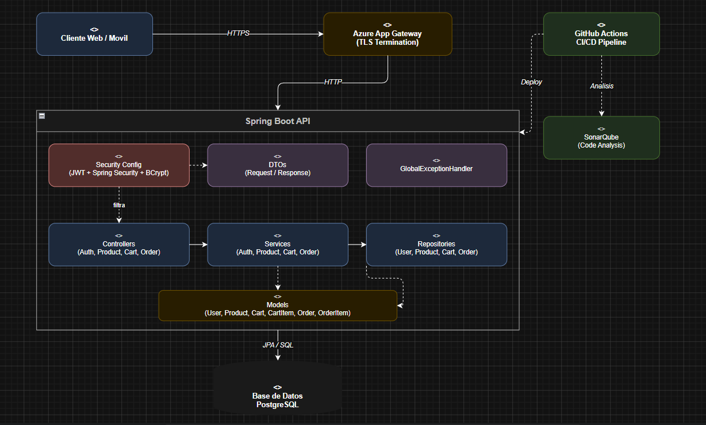
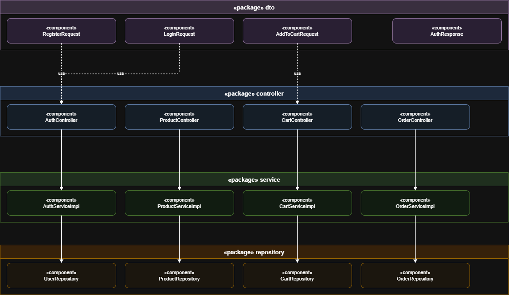
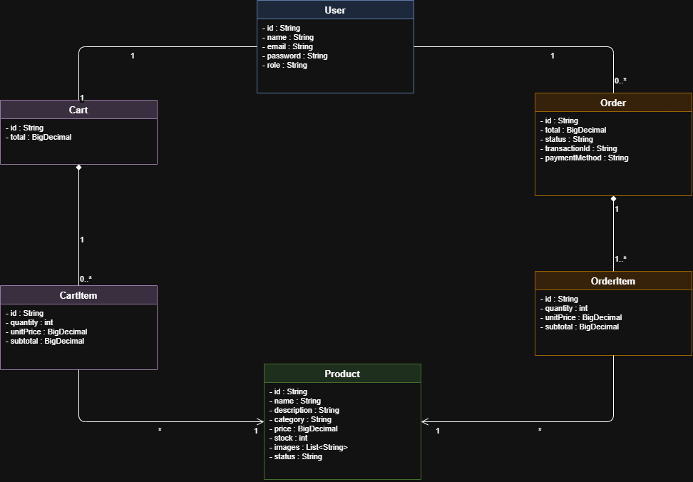

# ECI-SportLife

## MVP SportLife — Tienda Virtual de Productos Deportivos

SportLife es una API REST desarrollada con Spring Boot que gestiona usuarios, productos, carrito de compras y pagos para una tienda virtual de artículos deportivos.

---

## Diagrama De Componentes General



---

## Diagrama De Componentes Especificos



---

## Diagrama de Clases



---

# PARTE TEORICA

## 1. Matriz de Trazabilidad de Funcionalidades

| ID  | Funcionalidad                 | Prioridad | Tipo          | Depende de | Bloquea    |
| --- | ----------------------------- | --------- | ------------- | ---------- | ---------- |
| F1  | Registrar Usuario             | Alta      | Independiente | —          | F2         |
| F2  | Autenticar Usuario (Login)    | Alta      | Bloqueante    | F1         | F6, F7, F8 |
| F3  | Listar Catalogo de Productos  | Alta      | Independiente | —          | F4, F5     |
| F4  | Filtrar/Buscar Productos      | Media     | Derivada      | F3         | —          |
| F5  | Ver Detalle de Producto       | Alta      | Derivada      | F3         | F6         |
| F6  | Agregar Producto al Carrito   | Alta      | Bloqueada     | F2, F5     | F7         |
| F7  | Ver Resumen del Carrito       | Alta      | Derivada      | F6         | F8         |
| F8  | Iniciar Pago / Procesar Orden | Alta      | Bloqueada     | F7         | —          |

**Analisis de prioridad:** F1/F2 son la base sin la cual no existe flujo de compra. F3 es independiente y de alta prioridad por ser el punto de entrada al catalogo. F6, F7 y F8 conforman el flujo de compra y deben implementarse en orden. F4 es la unica de prioridad media por ser una mejora sobre F3.

---

## 2. Definicion Detallada de Funcionalidades

### F1 — Registrar Usuario

| Propiedad       | Valor                                                                      |
| --------------- | -------------------------------------------------------------------------- |
| **Verbo HTTP**  | `POST`                                                                     |
| **Endpoint**    | `/api/auth/register`                                                       |
| **Idempotente** | No — cada llamada crea una nueva entidad; correos duplicados generan error |

| Entrada    | Tipo   | Req | Descripcion                                        |
| ---------- | ------ | --- | -------------------------------------------------- |
| `name`     | String | Si  | Nombre completo (2-100 chars)                      |
| `email`    | String | Si  | Correo unico, formato valido                       |
| `password` | String | Si  | Min 8 chars, mayuscula, numero y caracter especial |

| Salida    | Tipo   | Descripcion              |
| --------- | ------ | ------------------------ |
| `message` | String | Confirmacion de registro |
| `userId`  | String | ID del nuevo usuario     |

| Codigo | Escenario            |
| ------ | -------------------- |
| `201`  | Registro exitoso     |
| `409`  | Correo ya registrado |
| `400`  | Datos invalidos      |
| `500`  | Error interno        |

---

### F2 — Autenticar Usuario (Login)

| Propiedad       | Valor                                                              |
| --------------- | ------------------------------------------------------------------ |
| **Verbo HTTP**  | `POST`                                                             |
| **Endpoint**    | `/api/auth/login`                                                  |
| **Idempotente** | No — genera un nuevo JWT con `iat`/`exp` distintos en cada llamada |

| Entrada    | Tipo   | Req | Descripcion            |
| ---------- | ------ | --- | ---------------------- |
| `email`    | String | Si  | Correo del usuario     |
| `password` | String | Si  | Contrasena del usuario |

| Salida  | Tipo   | Descripcion                 |
| ------- | ------ | --------------------------- |
| `token` | String | JWT para peticiones futuras |
| `type`  | String | Tipo de token (`Bearer`)    |

**Negocio:** el correo debe existir; password validado con BCrypt; mensaje de error generico (no revelar si fallo email o password).

| Codigo | Escenario              |
| ------ | ---------------------- |
| `200`  | Login exitoso          |
| `401`  | Credenciales invalidas |
| `400`  | Datos invalidos        |
| `500`  | Error interno          |

---

### F3 — Listar Catalogo de Productos

| Propiedad       | Valor                                 |
| --------------- | ------------------------------------- |
| **Verbo HTTP**  | `GET`                                 |
| **Endpoint**    | `/api/products`                       |
| **Idempotente** | Si — lectura pura, no modifica estado |

| Query Param | Tipo   | Req | Descripcion                        |
| ----------- | ------ | --- | ---------------------------------- |
| `category`  | String | No  | Filtrar por categoria              |
| `name`      | String | No  | Buscar por nombre (like)           |
| `page`      | int    | No  | Pagina (default: 0)                |
| `size`      | int    | No  | Elementos por pagina (default: 10) |

| Salida        | Tipo  | Descripcion                |
| ------------- | ----- | -------------------------- |
| `products`    | Array | Lista de productos activos |
| `totalItems`  | long  | Total de productos         |
| `totalPages`  | int   | Total de paginas           |
| `currentPage` | int   | Pagina actual              |

**Negocio:** solo retorna productos con estado `ACTIVE`. No requiere autenticacion.

| Codigo | Escenario       |
| ------ | --------------- |
| `200`  | Listado exitoso |
| `500`  | Error interno   |

---

### F4 — Filtrar / Buscar Productos

| Propiedad       | Valor                                          |
| --------------- | ---------------------------------------------- |
| **Verbo HTTP**  | `GET`                                          |
| **Endpoint**    | `/api/products?category=running&name=tenis`    |
| **Idempotente** | Si — lectura parametrizada, no modifica estado |

Extiende F3 mediante query params opcionales. Ver F3 para datos de entrada, salida, validaciones y codigos HTTP.

---

### F5 — Ver Detalle de Producto

| Propiedad       | Valor                          |
| --------------- | ------------------------------ |
| **Verbo HTTP**  | `GET`                          |
| **Endpoint**    | `/api/products/{id}`           |
| **Idempotente** | Si — lectura de recurso por ID |

| Salida        | Tipo           | Descripcion           |
| ------------- | -------------- | --------------------- |
| `id`          | String         | Identificador unico   |
| `name`        | String         | Nombre                |
| `description` | String         | Descripcion completa  |
| `category`    | String         | Categoria             |
| `price`       | BigDecimal     | Precio                |
| `stock`       | int            | Unidades disponibles  |
| `images`      | List\<String\> | URLs de imagenes      |
| `status`      | String         | `ACTIVE` / `INACTIVE` |

**Negocio:** producto inexistente o inactivo retorna 404.

| Codigo | Escenario              |
| ------ | ---------------------- |
| `200`  | Producto encontrado    |
| `404`  | Producto no encontrado |
| `400`  | ID invalido            |

---

### F6 — Agregar Producto al Carrito

| Propiedad       | Valor                                                                  |
| --------------- | ---------------------------------------------------------------------- |
| **Verbo HTTP**  | `POST`                                                                 |
| **Endpoint**    | `/api/cart/items`                                                      |
| **Idempotente** | No — incrementa cantidad o agrega item; estado cambia con cada llamada |

> Requiere `Authorization: Bearer <token>`

| Entrada     | Tipo   | Req | Descripcion      |
| ----------- | ------ | --- | ---------------- |
| `productId` | String | Si  | ID del producto  |
| `quantity`  | int    | Si  | Cantidad (min 1) |

| Salida    | Tipo   | Descripcion    |
| --------- | ------ | -------------- |
| `message` | String | Confirmacion   |
| `cartId`  | String | ID del carrito |
| `items`   | Array  | Items actuales |

**Negocio:** producto debe existir y estar activo; stock >= cantidad solicitada; si ya esta en carrito, sumar y revalidar stock.

| Codigo | Escenario              |
| ------ | ---------------------- |
| `200`  | Producto agregado      |
| `409`  | Stock insuficiente     |
| `404`  | Producto no encontrado |
| `401`  | No autorizado          |
| `400`  | Datos invalidos        |

---

### F7 — Ver Resumen del Carrito

| Propiedad       | Valor                                            |
| --------------- | ------------------------------------------------ |
| **Verbo HTTP**  | `GET`                                            |
| **Endpoint**    | `/api/cart`                                      |
| **Idempotente** | Si — lectura del carrito del usuario autenticado |

> Requiere `Authorization: Bearer <token>`

| Salida   | Tipo              | Descripcion             |
| -------- | ----------------- | ----------------------- |
| `cartId` | String            | ID del carrito          |
| `items`  | Array\<CartItem\> | Productos en el carrito |
| `total`  | BigDecimal        | Total de la compra      |

**Negocio:** si el carrito esta vacio, retorna lista vacia con total 0.

| Codigo | Escenario        |
| ------ | ---------------- |
| `200`  | Carrito obtenido |
| `401`  | No autorizado    |
| `500`  | Error interno    |

---

### F8 — Iniciar Pago / Procesar Orden

| Propiedad       | Valor                                                       |
| --------------- | ----------------------------------------------------------- |
| **Verbo HTTP**  | `POST`                                                      |
| **Endpoint**    | `/api/orders/checkout`                                      |
| **Idempotente** | No — crea orden, descuenta stock y genera transaccion unica |

> Requiere `Authorization: Bearer <token>`

| Entrada         | Tipo   | Req   | Descripcion                       |
| --------------- | ------ | ----- | --------------------------------- |
| `paymentMethod` | String | Si    | `CARD`, `PSE`, etc.               |
| `cardNumber`    | String | Cond. | Ultimos 4 digitos (si es tarjeta) |

| Salida          | Tipo       | Descripcion                     |
| --------------- | ---------- | ------------------------------- |
| `orderId`       | String     | ID de la orden                  |
| `status`        | String     | `PAID` o `REJECTED`             |
| `transactionId` | String     | ID de transaccion (si aprobado) |
| `total`         | BigDecimal | Total pagado                    |
| `message`       | String     | Mensaje al usuario              |
| `items`         | Array      | Productos comprados             |

**Negocio:** carrito no puede estar vacio; revalidar stock antes de cobrar; si aprobado → descontar stock y vaciar carrito; si rechazado → no modificar nada.

| Codigo | Escenario          |
| ------ | ------------------ |
| `201`  | Pago aprobado      |
| `402`  | Pago rechazado     |
| `400`  | Carrito vacio      |
| `409`  | Stock insuficiente |
| `401`  | No autorizado      |
| `500`  | Error interno      |

---

## 7. Seguridad — JWT + Spring Security + BCrypt

- **BCrypt**: hashea contrasenas antes de almacenarlas; nunca se guarda texto plano.
- **JWT**: autenticacion stateless; el cliente envia `Authorization: Bearer <token>` en cada peticion protegida.
- **Spring Security**: intercepta peticiones, valida el token en `JwtFilter` y establece el contexto de seguridad.

| Ventaja                  | Descripcion                                               |
| ------------------------ | --------------------------------------------------------- |
| Stateless                | No almacena sesiones; escala horizontalmente              |
| Estandar abierto         | JWT (RFC 7519) compatible con web, movil y microservicios |
| Seguridad de contrasenas | BCrypt con salt automatico; resistente a fuerza bruta     |
| Control de acceso        | Endpoints protegidos por rol con `@PreAuthorize`          |
| Expiracion de tokens     | `exp` limita la ventana de ataque ante robo de token      |

---

## 8. Roles e Identificacion de Permisos

| Rol     | Descripcion                                      |
| ------- | ------------------------------------------------ |
| `USER`  | Cliente registrado que puede comprar productos   |
| `ADMIN` | Administrador que gestiona catalogo e inventario |

| Funcionalidad                            | Sin Auth | USER | ADMIN |
| ---------------------------------------- | :------: | :--: | :---: |
| Registrar / Autenticar usuario           |    Si    |  Si  |  Si   |
| Listar / Filtrar / Ver productos         |    Si    |  Si  |  Si   |
| Agregar al carrito / Ver carrito / Pagar |    No    |  Si  |  No   |
| Crear / Editar / Desactivar producto     |    No    |  No  |  Si   |
| Ver todas las ordenes                    |    No    |  No  |  Si   |

---

## 9. TLS/SSL

**Infraestructura (recomendado):** certificado en el API Gateway; el trafico interno puede ser HTTP.

```
Cliente -- HTTPS --> Azure App Gateway (TLS Termination) -- HTTP --> Spring Boot API
```

**Aplicacion (Spring Boot):**

```properties
server.ssl.enabled=true
server.ssl.key-store=classpath:keystore.p12
server.ssl.key-store-password=secreto
server.ssl.key-store-type=PKCS12
server.port=8443
```

| Ventaja             | Descripcion                                              |
| ------------------- | -------------------------------------------------------- |
| Cifrado en transito | Credenciales, tokens y datos de pago viajan cifrados     |
| Autenticidad        | Previene ataques Man-in-the-Middle                       |
| Integridad          | Garantiza que los datos no fueron alterados en transito  |
| Cumplimiento        | PCI-DSS exige comunicaciones cifradas para datos de pago |

---

## 10. CORS

CORS restringe peticiones HTTP entre origenes distintos (dominio + puerto). Sin configuracion, el navegador bloquearia las llamadas del frontend (`https://app.sportlife.com`) hacia la API (`https://api.sportlife.com`).

```java
@Configuration
public class CorsConfig {
    @Bean
    public CorsConfigurationSource corsConfigurationSource() {
        CorsConfiguration config = new CorsConfiguration();
        config.setAllowedOrigins(List.of("https://app.sportlife.com"));
        config.setAllowedMethods(List.of("GET", "POST", "PUT", "DELETE", "OPTIONS"));
        config.setAllowedHeaders(List.of("Authorization", "Content-Type"));
        config.setAllowCredentials(true);
        UrlBasedCorsConfigurationSource source = new UrlBasedCorsConfigurationSource();
        source.registerCorsConfiguration("/api/**", config);
        return source;
    }
}
```

| Ventaja                | Descripcion                                                |
| ---------------------- | ---------------------------------------------------------- |
| Seguridad              | Evita peticiones maliciosas cross-origin (CSRF)            |
| Control granular       | Define metodos, cabeceras y origenes permitidos            |
| Compatibilidad         | Necesario para que navegadores modernos no bloqueen la API |
| Separacion de dominios | Permite API y frontend en dominios independientes          |

---

## 11. Diseno de Pantallas — Flujo de Compra

| Pantalla                    | Descripcion                                                           |
| --------------------------- | --------------------------------------------------------------------- |
| 1 — Lista de Productos      | Catalogo con imagen, nombre y precio; busqueda por nombre y categoria |
| 2 — Detalle de Producto     | Info completa, selector de cantidad y boton agregar al carrito        |
| 3 — Carrito de Compras      | Items con cantidad, precio unitario y subtotal; total y boton pagar   |
| 4 — Pasarela de Pago        | Resumen de orden, metodo de pago y formulario de tarjeta              |
| 5 — Confirmacion (Aprobado) | ID de orden, ID de transaccion, resumen y boton volver al catalogo    |
| 6 — Pago Rechazado          | Mensaje de error con opciones para reintentar o volver al carrito     |

---

> **Tiempo de realizacion parte teorica:** 2.5 horas

---

# PARTE PRACTICA

## Estructura del Proyecto (Scaffolding MVC)

```
└───ECI-SportLife
    ├───.github
    │   └───workflows
    └───src
        └───main
            ├───Evidencia
            ├───java
            │   └───com
            │       └───dosw
            │           └───sportlife
            │               ├───config
            │               ├───controller
            │               ├───dto
            │               │   ├───request
            │               │   └───response
            │               ├───exception
            │               ├───model
            │               ├───repository
            │               └───service
            │                   └───impl
            └───resources
```

## Pipeline CI/CD (GitHub Actions)

El pipeline en `.github/workflows/pipeline.yml` automatiza build, test, analisis SonarQube y deploy en Azure. Se ejecuta en push/merge de `feature/**` → `develop` y `develop` → `main`.

## Flujo de Ramas Git

```
main <- develop <- feature/registro-usuario
                <- feature/autenticacion
                <- feature/catalogo-productos
                <- feature/carrito-compras
                <- feature/proceso-pago
```
